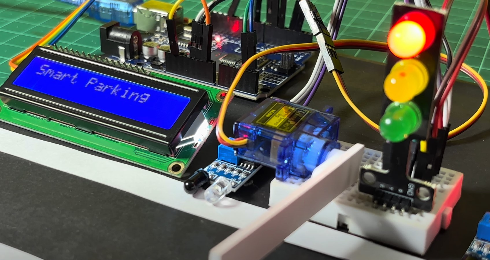
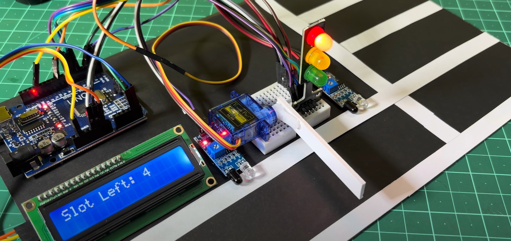
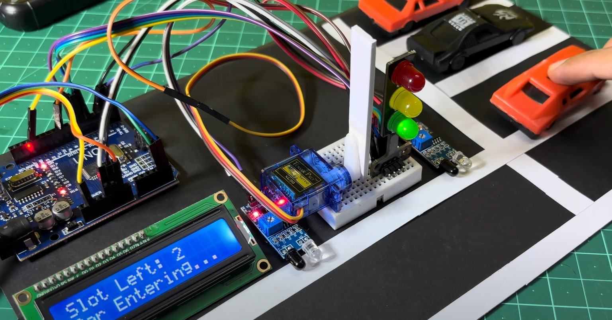
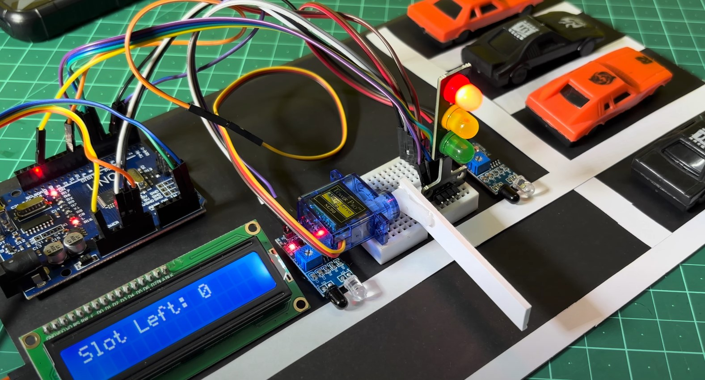
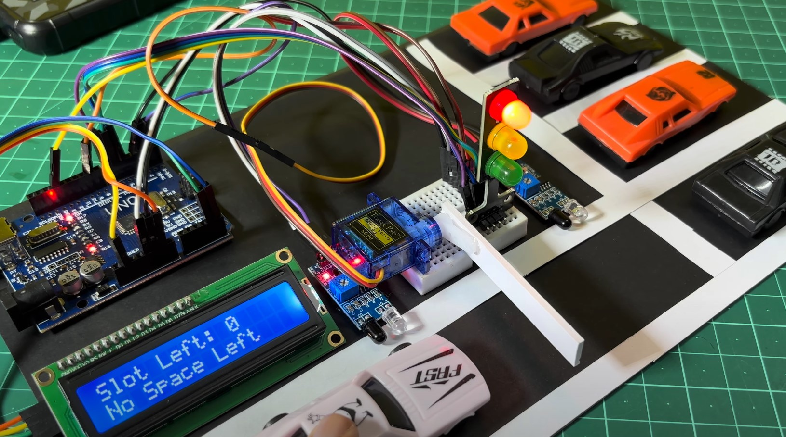

 Smart Parking System

> An automated parking-management prototype that detects vehicles with FC-51 IR
> sensors at the entrance and exit and controls access through a servo gate,
> driven by a finite-state-machine firmware on an Arduino Uno. Live occupancy is
> shown on an LCD with traffic-light feedback.



---

## Problem

Conventional parking lots give drivers no live information about availability —
you enter, search, and often find the lot full only after wasting time and fuel.
This project demonstrates an automated, low-cost alternative: a system that
tracks occupancy in real time, controls access automatically, and shows drivers
the number of free spaces at a glance.

<!-- [VERIFY] Optional: "Total bill of materials ≈ $22." Keep this only if you
have actually added up the real part prices. Otherwise delete this comment. -->

---

## How It Works

- **Two FC-51 IR sensors** detect vehicles at the entrance and the exit
  (active-LOW digital output — LOW when a car breaks the beam).
- The system **counts cars in and out against a 4-space capacity** — it tracks
  total occupancy rather than sensing each individual bay.
- A **finite state machine** in firmware manages the full gate cycle:
  `idle → car detected → check capacity → open → pass-through → close`.
- An **SG90 servo** drives the entry/exit barrier (0° closed, 90° open).
- A **16×2 I²C LCD** displays live status — free-slot count and OPEN / FULL.
- A **traffic-light LED module** gives instant visual feedback
  (green = enter, yellow = gate moving, red = full).


---

## Key Components

- **Microcontroller:** Arduino Uno R3 (ATmega328P)
- **Sensors:** FC-51 IR obstacle sensors ×2 (entrance + exit)
- **Actuator:** TowerPro SG90 micro servo (gate barrier)
- **Display:** 16×2 character LCD with PCF8574 I²C backpack
- **Indicators:** Traffic-light LED module (R/Y/G)
- **Custom PCB:** Arduino carrier shield (see [`/hardware`](hardware/))

Full parts list in [`docs/`](docs/).

---

## Engineering Notes — From Simulation to Hardware

The control logic was first validated in a **Wokwi simulation**, then ported to
the physical board. That port was the most instructive part of the build:

- **Different sensors in simulation vs hardware.** Wokwi doesn't provide the
  FC-51 IR module, so the simulation uses **HC-SR04 ultrasonic** sensors while
  the real board uses **FC-51 IR**. The two firmwares detect vehicles
  differently as a result: the simulation reads an ultrasonic *distance* and
  compares it against a threshold, whereas the real board reads the FC-51's
  *digital beam-break* output directly. Both versions live in
  [`firmware/`](firmware/).
- **Debouncing the IR input.** A raw IR module can blip on ambient light or a
  passing hand, so the firmware only accepts a vehicle after several consecutive
  "detected" reads — rejecting single-frame false triggers.
- **A gate safety timeout.** If a vehicle stalls in the beam or a sensor sticks
  on, the gate force-closes after a fixed timeout instead of hanging open and
  freezing the whole system.

---

## The System in Action

The physical prototype running a complete parking cycle — from an empty lot,
through a vehicle entering, to a full lot denying access:

| | | |
|:--:|:--:|:--:|
|  |  |  |
| **Lot empty** — 4 slots free, gate down | **Car approaches** the entrance sensor | **Gate opens** — "Car entering...", yellow light |
|  |  |  |
| **Slot count drops** as the car passes | **Lot full** — 0 spaces available | **Access denied** — "No Space Left", red light |

---

## Simulation

The full control logic was validated in a Wokwi simulation before hardware
testing (sensor difference explained in *Engineering Notes* above).


▶️ **Full simulation video:** <!-- [FILL IN] drag your .mp4 into the GitHub
editor here to embed the player, or paste an Unlisted YouTube link -->

---

## Repository Structure

```
smart-parking-system/
├── firmware/
│   ├── smart_parking_system.ino        Real board (FC-51 IR)
│   └── simulation/
│       └── smart_parking_sim.ino       Wokwi simulation (HC-SR04)
├── hardware/     KiCad schematic, PCB layout, Gerbers
├── docs/         Bill of materials, design notes
├── media/        Real-build photos, simulation schematic, video/GIF
└── README.md
```

---

## Status

Working hardware prototype, 2026.

<!-- [VERIFY] Optional metric: "Detection accuracy 100% (entrance) / 95% (exit)
over 20 trials each." Keep this ONLY if you actually ran and logged these
trials. If you didn't, delete this comment entirely. -->
